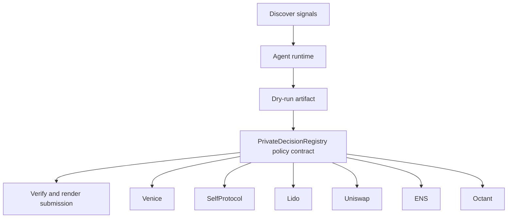

# Shadow Treasury Desk

- **Repo:** [Synthesis-Venice-PrivateAgents](https://github.com/CrystallineButterfly/Synthesis-Venice-PrivateAgents)
- **Primary track:** Venice Private Agents
- **Category:** privacy
- **Primary contract:** `PrivateDecisionRegistry`
- **Primary module:** `venice_private_desk`
- **Submission status:** audited and offline-demo ready; optional live partner credentials unlock network execution.

## What this repo does

A private reasoning desk that keeps sensitive treasury, governance, and grant analysis off public rails while still producing verifiable downstream actions.

## Why this build matters

Sensitive inputs are routed through a private-analysis module, while only redacted decisions, hashes, and consequence proofs reach public logs. A policy contract binds each private recommendation to a permitted action envelope so the repo stays privacy-first and auditable.

## Submission fit

- **Primary track:** Venice Private Agents
- **Overlap targets:** SelfProtocol, Lido stETH Treasury, Uniswap Agentic Finance, ENS, Octant, MetaMask Delegations
- **Partners covered:** Venice, SelfProtocol, Lido, Uniswap, ENS, Octant, MetaMask Delegations

## Idea shortlist

1. Confidential Treasury Copilot
2. Private Risk Desk
3. Private Octant Grant Scorer

## System graph



## Repository contents

| Path | What it contains |
| --- | --- |
| `src/` | Shared policy contracts plus the repo-specific wrapper contract. |
| `script/Deploy.s.sol` | Foundry deployment entrypoint for the policy contract. |
| `agents/` | Python runtime, project spec, env handling, and partner adapters. |
| `scripts/` | Terminal entrypoints for run, demo planning, and submission rendering. |
| `docs/` | Architecture, credentials, security notes, and demo steps. |
| `submissions/` | Generated `synthesis.md` snippet for this repo. |
| `test/` | Foundry tests for the Solidity control layer. |
| `tests/` | Python tests for runtime and project context. |
| `agent.json` | Submission-facing agent manifest. |
| `agent_log.json` | Local execution log and status trail. |

## Autonomy loop

1. Discover signals relevant to the repo track and its overlap targets.
2. Build a bounded plan with per-action and compute caps.
3. Persist a dry-run artifact before any live execution.
4. Enforce onchain policy through the guarded contract wrapper.
5. Verify outputs, update receipts, and render submission material.

## Current readiness

- **Latest verification:** `verified` at `2026-03-19T03:52:21+00:00`
- **Execution mode:** `offline_prepared`
- **Offline-prepared partners:** Lido (prepared_contract_call), ENS (prepared_contract_call), MetaMask Delegations (prepared_contract_call)
- **Live credential blockers:** Venice, SelfProtocol, Uniswap, Octant
- **Audit docs:** `docs/audit.md`, `docs/live_readiness.md`

## Most sensitive actions

- `venice_private_analysis` (Venice, high)
- `selfprotocol_zk_verify` (SelfProtocol, high)
- `metamask_delegations_delegate_scope` (MetaMask Delegations, high)

## Live blocker details

- **Venice** — VENICE_API_KEY, VENICE_CHAT_COMPLETIONS_URL, VENICE_MODEL — https://docs.venice.ai/
- **SelfProtocol** — SELF_PROTOCOL_API_KEY, SELF_VERIFICATION_URL — https://docs.self.xyz/
- **Uniswap** — UNISWAP_API_KEY, UNISWAP_QUOTE_URL — https://developers.uniswap.org/
- **Octant** — OCTANT_SIGNAL_URL — https://octant.app/

## Latest evidence artifacts

- `artifacts/onchain_intents/lido_yield_route.json`
- `artifacts/onchain_intents/ens_ens_publish.json`
- `artifacts/onchain_intents/metamask_delegations_delegate_scope.json`

## Security controls

- Admin-managed allowlists for targets and selectors.
- Per-action caps, daily caps, cooldown windows, and a principal floor.
- Reporter-only receipt anchoring and proof attachment.
- Env-only secrets; no committed private keys or partner tokens.
- Pause switch plus dry-run-first execution flow.

## Action catalog

| Action | Partner | Purpose | Max USD | Sensitivity |
| --- | --- | --- | --- | --- |
| `venice_private_analysis` | Venice | Use Venice for a bounded action in this repo. | $5 | high |
| `selfprotocol_zk_verify` | SelfProtocol | Use SelfProtocol for a bounded action in this repo. | $3 | high |
| `lido_yield_route` | Lido | Use Lido for a bounded action in this repo. | $200 | medium |
| `uniswap_quote_route` | Uniswap | Use Uniswap for a bounded action in this repo. | $220 | medium |
| `ens_ens_publish` | ENS | Use ENS for a bounded action in this repo. | $5 | low |
| `octant_signal_publish` | Octant | Use Octant for a bounded action in this repo. | $25 | medium |
| `metamask_delegations_delegate_scope` | MetaMask Delegations | Use MetaMask Delegations for a bounded action in this repo. | $2 | high |

## Local terminal flow (Anvil + Sepolia)

```bash
export SEPOLIA_RPC_URL=https://sepolia.infura.io/v3/YOUR_KEY
anvil --fork-url "$SEPOLIA_RPC_URL" --chain-id 11155111
cp .env.example .env
# keep private keys only in .env; TODO.md stays local-only too
forge script script/Deploy.s.sol --rpc-url "$RPC_URL" --broadcast
python3 scripts/run_agent.py
python3 scripts/render_submission.py
```

## Commands

```bash
python3 -m unittest discover -s tests
forge test
python3 scripts/run_agent.py
python3 scripts/plan_live_demo.py
python3 scripts/render_submission.py
```

## Credentials

| Partner | Variables | Docs |
| --- | --- | --- |
| Venice | VENICE_API_KEY, VENICE_CHAT_COMPLETIONS_URL, VENICE_MODEL | https://docs.venice.ai/ |
| SelfProtocol | SELF_PROTOCOL_API_KEY, SELF_VERIFICATION_URL | https://docs.self.xyz/ |
| Lido | RPC_URL | https://docs.lido.fi/ |
| Uniswap | UNISWAP_API_KEY, UNISWAP_QUOTE_URL | https://developers.uniswap.org/ |
| ENS | ENS_NAME | https://docs.ens.domains/ |
| Octant | OCTANT_SIGNAL_URL | https://octant.app/ |
| MetaMask Delegations | RPC_URL | https://docs.metamask.io/delegation-toolkit/ |

## Live demo plan

1. Copy .env.example to .env and fill the required keys.
2. Deploy the contract with forge script script/Deploy.s.sol --broadcast for PrivateDecisionRegistry.
3. Run python3 scripts/run_agent.py to produce a dry run for venice_private_desk.
4. Set LIVE_MODE=true and rerun python3 scripts/run_agent.py with real credentials.
5. Run python3 scripts/render_submission.py and attach TxIDs plus repo links.
